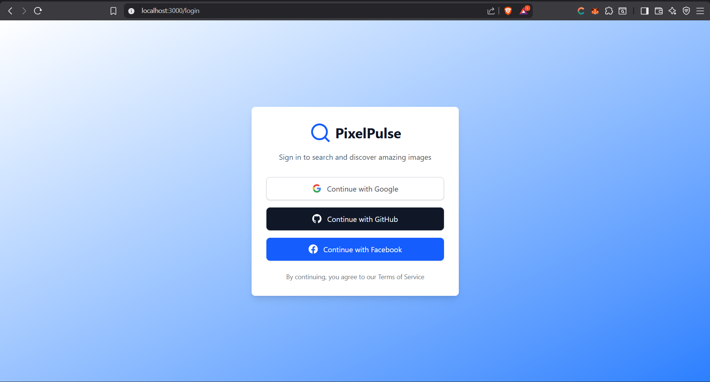
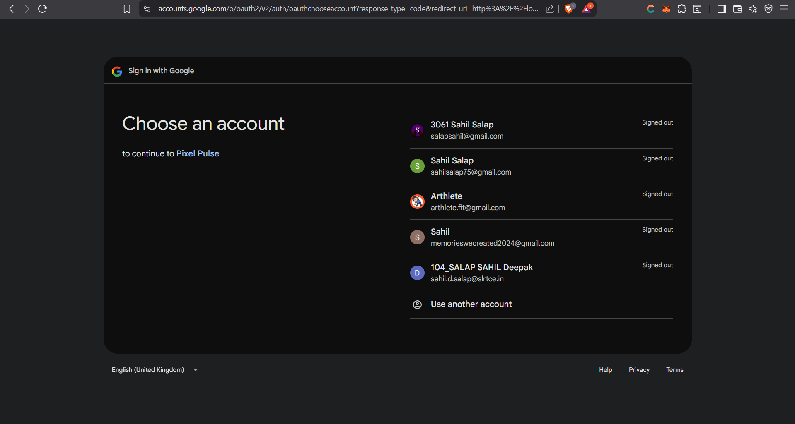
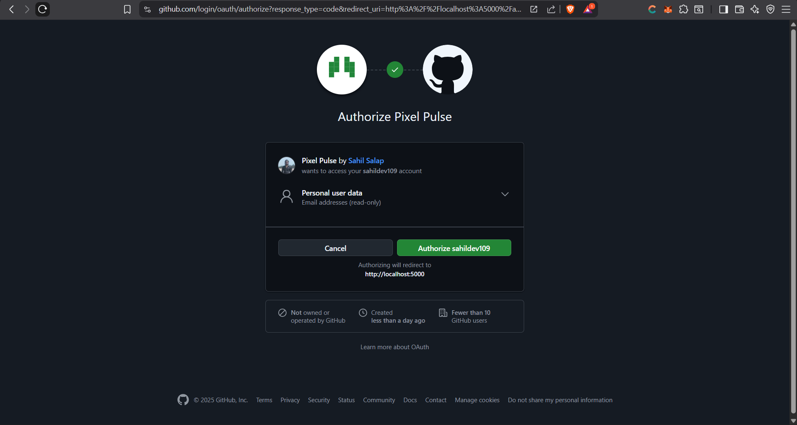
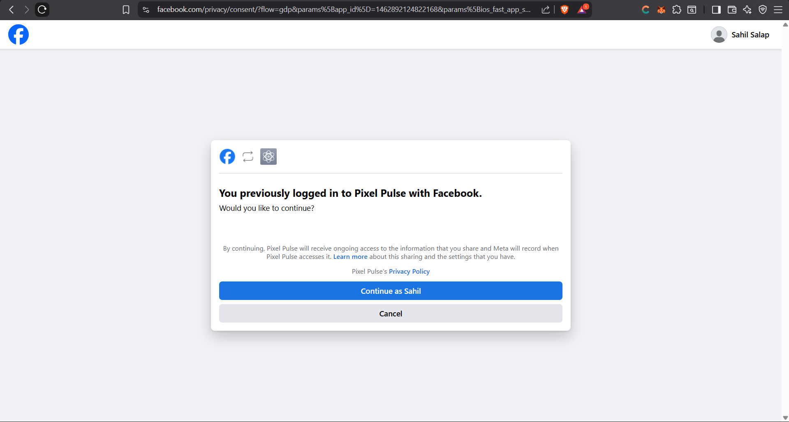
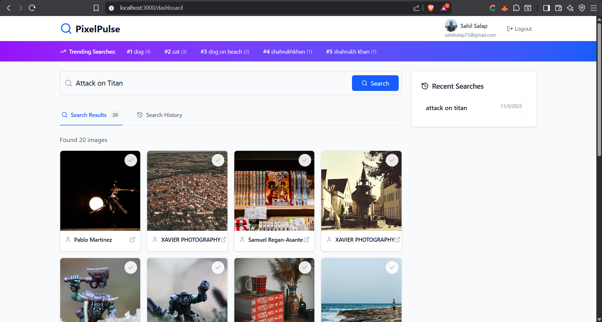
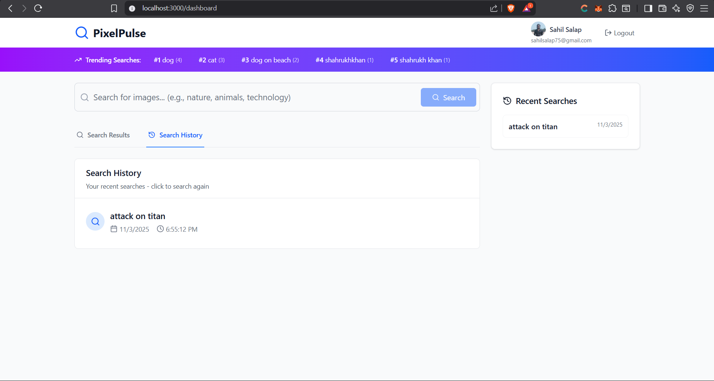

# PixelPulse - Image Search & Multi-Select Application


<br>

     


## A full-stack image search application built with the MERN stack and OAuth authentication. Users can search for images from Unsplash, multi-select images, view trending searches, and maintain their search history.

## ⚙️ Setup Instructions
### Prerequisites
#### Node.js (v16 or higher)
#### MongoDB (local or Atlas)
#### Git

#### 1. Clone the Repository
```bash
git clone https://github.com/sahildev109/Pixel-Pulse.git
cd pixelpulse
```
## 2. Backend Setup
```bash
cd server
# Install dependencies
npm install
```
## Server Environment Variables (.env)
# Server Configuration
```env
PORT=5000
CLIENT_URL=http://localhost:3000

# Database
MONGODB_URI=mongodb://localhost:27017/pixelpulse

# Session
SESSION_SECRET=your-super-secret-session-key-here

# OAuth Credentials
GOOGLE_CLIENT_ID=your-google-oauth-client-id
GOOGLE_CLIENT_SECRET=your-google-oauth-client-secret
GITHUB_CLIENT_ID=your-github-oauth-client-id
GITHUB_CLIENT_SECRET=your-github-oauth-client-secret
FACEBOOK_CLIENT_ID=your-facebook-oauth-client-id
FACEBOOK_CLIENT_SECRET=your-facebook-oauth-client-secret

# Unsplash API
UNSPLASH_ACCESS_KEY=your-unsplash-access-key
```
## 3. Frontend Setup
```bash
cd ../client

# Install dependencies
npm install
```
## 4. Start the Application
### Terminal 1 - Backend:

```bash
cd server
npm run dev
```
### Terminal 2 - Frontend:

```bash
cd client
npm run dev
```
The application will be available at:

Frontend: http://localhost:3000

Backend: http://localhost:5000

## 📁 Folder Structure

```bash
pixelpulse/
├── client/                 # React frontend
│   ├── src/
│   │   ├── components/     # Reusable components
│   │   │   ├── ImageGrid.jsx
│   │   │   ├── SearchBar.jsx
│   │   │   ├── SearchHistory.jsx
│   │   │   ├── TopSearches.jsx
│   │   │   └── ProtectedRoute.jsx
│   │   ├── contexts/       # React contexts
│   │   │   └── AuthContext.jsx
│   │   ├── pages/          # Page components
│   │   │   ├── Dashboard.jsx
│   │   │   └── Login.jsx
│   │   ├── App.jsx
│   │   └── main.jsx
│   ├── package.json
│   ├── vite.config.js
│   └── tailwind.config.js
├── server/                 # Express backend
│   ├── config/
|   |   ├── db.js           # MongoDB configuration
│   │   └── passport.js     # OAuth configuration
|   ├── controllers/        #Controllers
|   |   ├── auth.controller.js
│   │   ├── history.controller.js
│   │   └── search.controller.js
│   ├── middlewares/        #Middleware
│   │   └── auth.middleware.js
│   ├── models/                 # MongoDB models
│   │   ├── User.js
│   │   └── SearchHistory.js
│   ├── routes/             # API routes
│   │   ├── auth.js
│   │   ├── search.js
│   │   └── history.js
│   ├── server.js
│   └── package.json
└── README.md
```
## 🗃️ Database Models
### User Model
```javascript
{
  provider: String,        // 'google', 'github', 'facebook'
  providerId: String,      // OAuth provider ID
  name: String,            // User's display name
  email: String,           // User's email
  avatar: String,          // Profile picture URL
  createdAt: Date          // Account creation date
}
```
### SearchHistory Model
```javascript
{
  userId: ObjectId,        // Reference to User
  term: String,            // Search term
  timestamp: Date          // When search was performed
}
```

## 📡 API Endpoints

### 🔐 Authentication Endpoints

#### **GET /auth/google**
Initiates Google OAuth flow.

**cURL:**
```bash
curl -X GET "http://localhost:5000/auth/google"
```

---

#### **GET /auth/google/callback**
Google OAuth callback URL.

---

#### **GET /auth/current**
Get current authenticated user.

**cURL:**
```bash
curl -X GET "http://localhost:5000/auth/current" \
  -H "Content-Type: application/json" \
  -b "session_cookie"
```

**Response:**
```json
{
  "_id": "user_id",
  "name": "John Doe",
  "email": "john@example.com",
  "avatar": "https://avatar.url"
}
```

---

#### **GET /auth/logout**
Logout user.

**cURL:**
```bash
curl -X GET "http://localhost:5000/auth/logout"
```

---

### 🖼️ Search Endpoints

#### **POST /api/search**
Search for images.

**cURL:**
```bash
curl -X POST "http://localhost:5000/api/search" \
  -H "Content-Type: application/json" \
  -b "session_cookie" \
  -d '{"term": "nature"}'
```

**Response:**
```json
[
  {
    "id": "image_id",
    "url": "https://images.unsplash.com/photo-123",
    "thumb": "https://images.unsplash.com/photo-123-thumb",
    "alt": "Beautiful nature landscape",
    "photographer": "John Photographer",
    "photographerUrl": "https://unsplash.com/@john"
  }
]
```

---

#### **GET /api/top-searches**
Get top 5 trending searches.

**cURL:**
```bash
curl -X GET "http://localhost:5000/api/top-searches" \
  -H "Content-Type: application/json" \
  -b "session_cookie"
```

**Response:**
```json
[
  {
    "_id": "nature",
    "count": 15
  },
  {
    "_id": "animals",
    "count": 12
  }
]
```

---

### 🕓 History Endpoints

#### **GET /api/history**
Get user's search history.

**cURL:**
```bash
curl -X GET "http://localhost:5000/api/history" \
  -H "Content-Type: application/json" \
  -b "session_cookie"
```

**Response:**
```json
[
  {
    "_id": "history_id",
    "term": "nature",
    "timestamp": "2023-10-01T10:30:00.000Z",
    "userId": "user_id"
  }
]
```
---


## 📸 Screenshots
### **OAuth Login Page**


### **Google OAuth Login Page**


### **GitHub OAuth Login Page**


### **Facebook OAuth Login Page**


### **Dashboard Page**


### **Dashboard with Search Results**

### **Multi-Select Feature**


### **Search History**


## 🚀 Features
### 🔐 OAuth Authentication - Login with Google, GitHub, and Facebook

### 🖼️ Image Search - Search high-quality images from Unsplash API

### 📊 Top Searches - View trending search terms across all users

### 📝 Search History - Personal search history with timestamps

### ☑️ Multi-Select - Select multiple images with visual indicators

### 🎨 Modern UI - Built with Tailwind CSS and Lucide React icons

### 📱 Responsive Design - Works seamlessly on all devices
---
## 👥 Author
### **Sahil Salap**
#### **sahilsalap@gmail.com**
#### [Linkedin](www.linkedin.com/in/sahil-salap-1877712b8)
<div align="center">
Built with ❤️ using the MERN Stack

</div>